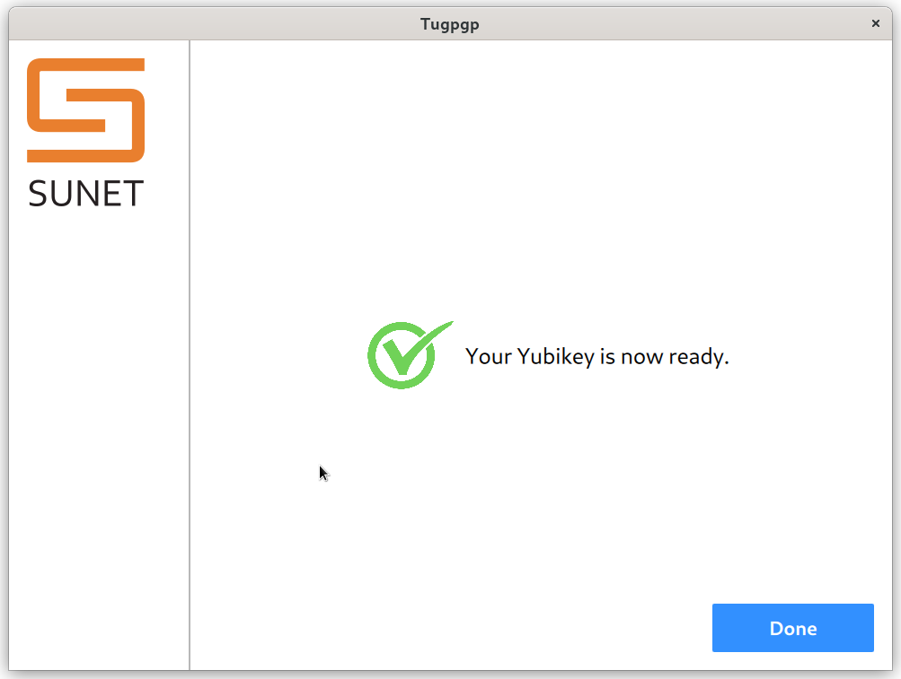

## tugpgp

An utility to create and upload OpenPGP keys to Yubikey. The tool will not write the generated key on disk unless specifically asked.

Under active development.


### LICENSE: GPL-3.0-or-later


### Next create the virtualenv

```
python3 -m venv .venv 
source .venv/bin/activate
python3 -m pip install wheel
python3 -m pip install -U pip
python3 -m pip install -r requirements.txt
```

We need [johnnycanencrypt](https://github.com/kushaldas/johnnycanencrypt) version 0.13.1 or above.

### How to use the tool?


```
briefcase dev
```



