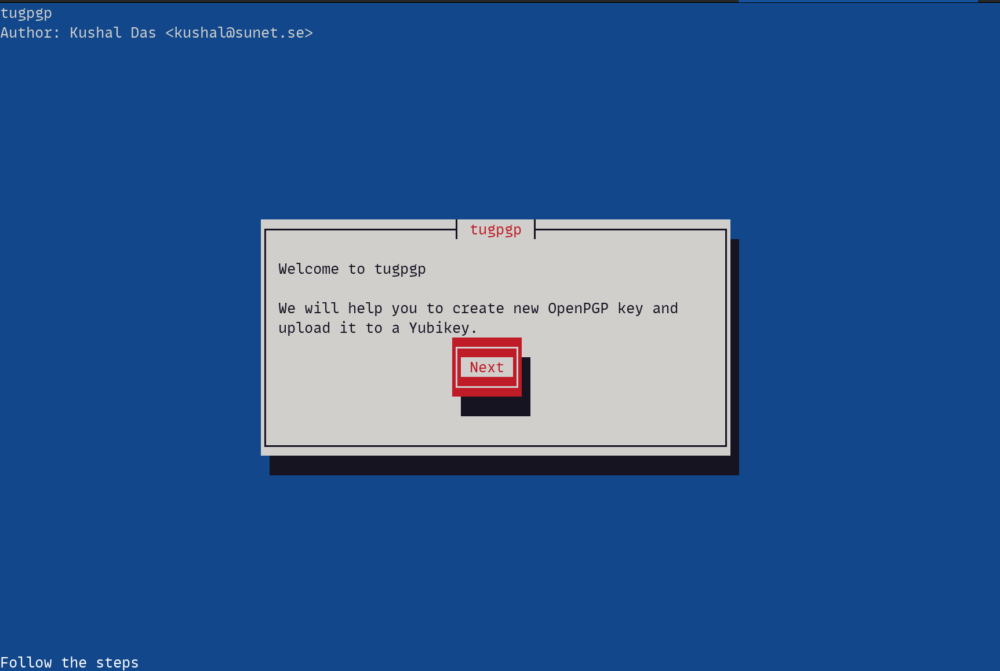

## tugpgp

An utility to create and upload OpenPGP keys to Yubikey. The tool will not write the generated key on disk unless specifically asked.

Under active development.


### LICENSE: GPL-3.0-or-later

## Install the dependencies

### On Linux

`apt install python3-newt` or `dnf install python3-newt`.

### On Mac

`brew install newt` on Mac.


### Next create the virtualenv

```
python3 -m venv .venv --system-site-packages
source .venv/bin/activate
python3 -m pip install wheel
python3 -m pip install johnnycanencrypt
```

We need [johnnycanencrypt](https://github.com/kushaldas/johnnycanencrypt) version 0.11.0 or above.

### How to use the tool?


```
python3 -m tugpgp
```




### To turn off or on touch policy of the authentication in Yubikey


```
python -m tugpgp --touch-auth-off
Admin pin of the Yubikey: 
Your Yubikey's touch policy is now changed.
```

To turn on again

```
python -m tugpgp --touch-auth-on
Admin pin of the Yubikey: 
Your Yubikey's touch policy is now changed.
```

